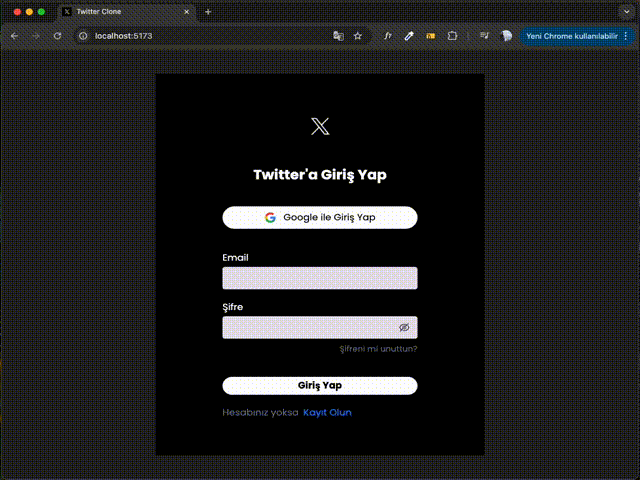

# Twitter Clone

This project is a Twitter clone developed using **React**, **TailwindCSS**, and **Firebase**. Key features include a user registration/login system, tweet creation, liking, commenting, and user interaction.

---

## 📌 Features

- User registration and login (Firebase Authentication)
- Creating, deleting, and listing tweets
- Liking and commenting on tweets
- Real-time data updates (Firebase Firestore)
- Responsive design (mobile and desktop compatible)
- Notification system (React Toastify)

---

## 💻 Technologies

- **React** (v19)
- **TailwindCSS** (v4)
- **Firebase** (v12)
- **React Router Dom** (v7)
- **Day.js** (date formatting)
- **UUID** (unique ID generation)
- **React Icons**
- **React Toastify** (notifications)
- **Vite** (rapid development and build)

## 📸 ScreenShot

